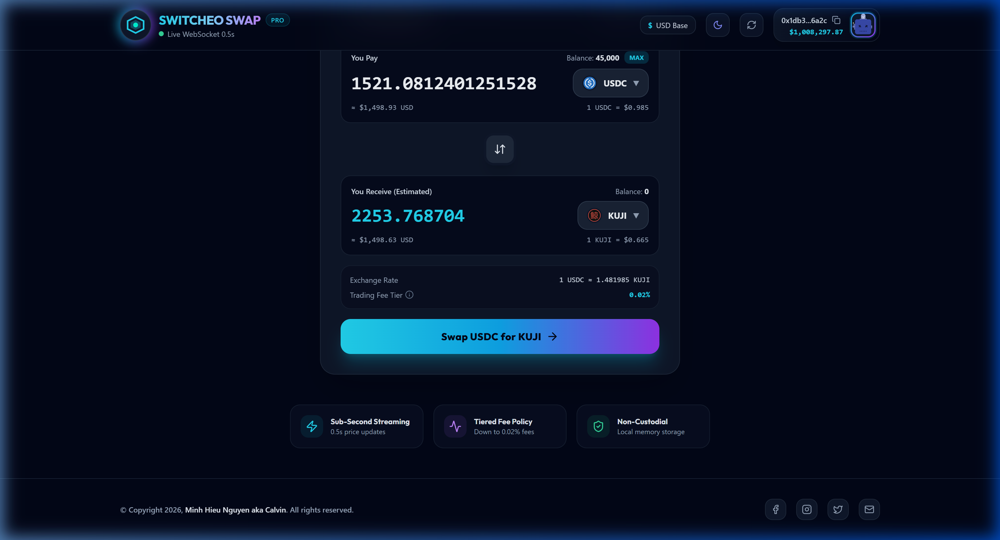
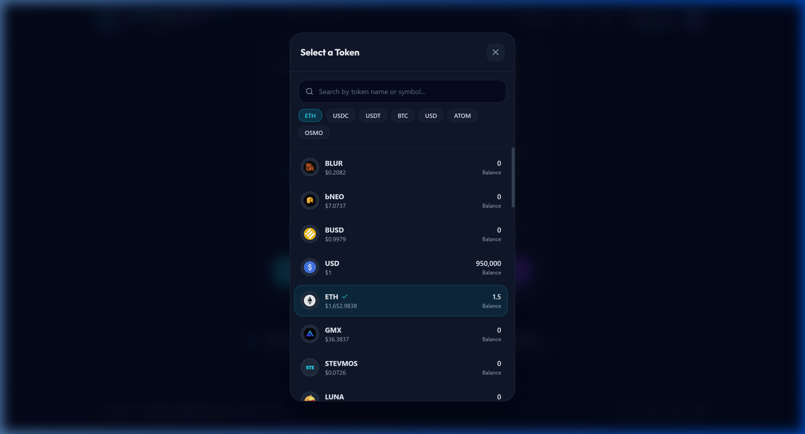
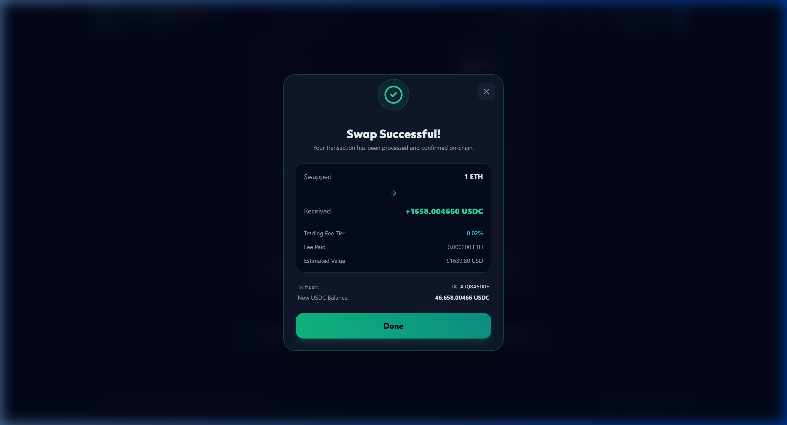

# Problem 2: Fancy Currency Swap Application

A full-stack, high-performance decentralized token swap application featuring a real-time price streaming backend server and an interactive, glassmorphic React frontend.

---

## 📜 Inventory & Ownership

| Inventory Item | File Path | Owner / Author | Description |
| :--- | :--- | :--- | :--- |
| **Task Specifications** | [`task.md`](task.md) | **Minh Hieu Nguyen aka Calvin** (Author) | Problem statement & evaluation criteria. |
| **Solution Requirements** | [`solution.md`](solution.md) | **Minh Hieu Nguyen aka Calvin** (Author) | Functional specs & architectural direction. |
| **Backend Source Code** | [`server/`](server) | **Gemini 3.6 Flash (High)** (LLM Agent) | Express + Socket.IO TypeScript backend. |
| **Frontend Source Code** | [`client/`](client) | **Gemini 3.6 Flash (High)** (LLM Agent) | React + Vite + Tailwind + Zustand frontend. |
| **Implementation Log** | [`REPORT.md`](REPORT.md) | **Gemini 3.6 Flash (High)** (LLM Agent) | Granular development progress & patches. |

---

## 🛠 Used Technologies

### Frontend
- **Framework & Build Tool**: [React 18](https://react.dev/) + [Vite 6](https://vitejs.dev/) + [TypeScript 5](https://www.typescriptlang.org/)
- **Styling & Aesthetics**: [Tailwind CSS 3](https://tailwindcss.com/) + Glassmorphism tokens + Dark/Light Mode
- **State Management**: [Zustand 5](https://zustand-demo.pmnd.rs/) with `localStorage` persistence
- **Real-Time Communication**: `socket.io-client 4`
- **UI Components & Icons**: [Lucide React](https://lucide.dev/) + [Framer Motion](https://www.framer.com/motion/)

### Backend
- **Runtime & Server Framework**: [Node.js](https://nodejs.org/) v20+ + [Express.js](https://expressjs.com/) + [TypeScript](https://www.typescriptlang.org/)
- **WebSocket Streaming**: [Socket.IO 4](https://socket.io/) (1s broadcast interval)
- **HTTP Client & Middleware**: Axios, CORS, ts-node-dev

---

## ✨ Key Features

1. **Real-Time Price Engine**:
   - Fetches and normalizes live market prices from Switcheo API (`prices.json`).
   - Streams live rate fluctuations to connected clients every **1s** (1000ms) via WebSocket.
2. **Dynamic Tiered Fee Structure**:
   - Swaps `< $100 USD`: **0.10% fee**
   - Swaps `$100 - $1,000 USD`: **0.05% fee**
   - Swaps `>= $1,000 USD`: **0.02% fee**
3. **Interactive Token Selector**:
   - Modal with real-time text search and quick filter tags (`ETH`, `USDC`, `BTC`, `ATOM`, `OSMO`).
   - Displays user balances per currency and falls back gracefully for missing SVGs.
4. **Comprehensive Validation & Error Handling**:
   - Real-time input checking (positive numbers, decimal sanity, balance limits).
   - Detects unsupported/unavailable tokens and displays clear alert banners.
   - Prevents invalid form submissions and shows loading spinners during server processing.
5. **Instant Local Settlement & Persistence**:
   - Saves wallet address, random avatar, theme preference, and updated token balances in browser `localStorage`.
6. **Pop-up Transaction Receipt**:
   - Displays full execution summary (Tx Hash, fee tier, net payout, new balance).

---

## 📸 Page Screenshots

### 1. Main Page Interface


### 2. Searchable Currency Selection Modal


### 3. Transaction Success Popup


---

## ⚡ Setup & Run Guidelines

### Prerequisites
- Node.js `v20.x` or higher
- npm `v10.x` or higher

### Installation & Execution

```bash
# 1. Navigate to problem2 directory
cd src/problem2

# 2. Install dependencies for workspace, backend, and frontend
npm run install:all

# 3. Launch Backend API (port 3001) & Frontend Vite App (port 3000) concurrently
npm run dev

# 4. Access the web application at http://localhost:3000
```

### Production Build & Type Verification

```bash
# Compile TypeScript and bundle frontend/backend assets
npm run build
```

---

## 📊 Progress & Development Report

For detailed progress tracking, tagged entries, line-by-line implementation breakdowns, and bug patches, please consult the [`REPORT.md`](REPORT.md) file.
