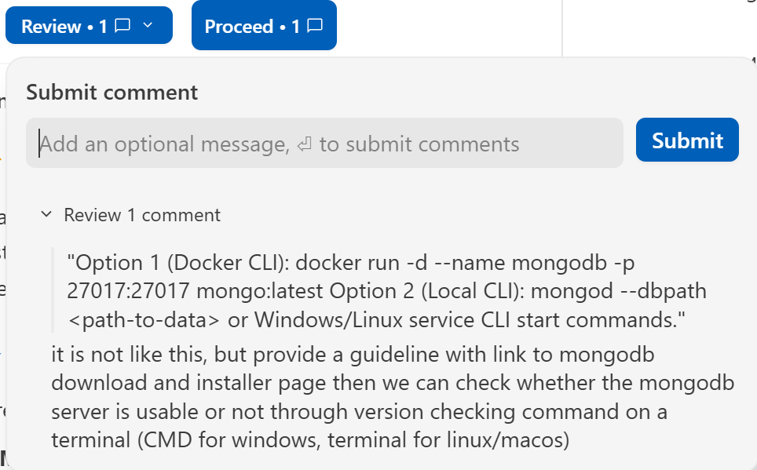

# Implementation Plan - Problem 5: Student CRUD Service with ExpressJS, TypeScript, MongoDB & Swagger

Implement a robust, production-grade ExpressJS + TypeScript backend service managing `Student` resources (containing `name`, `dateOfBirth`, `gender`) backed by MongoDB, with full Swagger API documentation, Postman collection, an Agent Skill for API docs synchronization, CLI setup guidelines for MongoDB, and comprehensive setup & inventory documentation.

## User Review Required

> [!IMPORTANT]
> MongoDB CLI Server Setup: `README.md` will provide explicit step-by-step CLI commands for setting up and starting the MongoDB server (via Docker CLI `docker run -d --name mongodb -p 27017:27017 mongo:latest` as well as local `mongod` service CLI commands) plus a database seed command (`npm run seed`).

> [!NOTE]
> Agent Skill Location: The skill for synchronizing Swagger, Postman, and REST API definitions will be placed under `.agents/skills/sync-api-docs/SKILL.md` within `src/problem5/`, adhering to Antigravity's workspace skill conventions.

## Open Questions

- **Date Format Preference**: Should `dateOfBirth` be stored and validated as an ISO-8601 string / Date object (e.g., `YYYY-MM-DD`)? (Plan assumes standard ISO-8601 Date representation).
- **Gender Options**: Plan assumes `gender` is restricted to `'male'`, `'female'`, `'other'` via enum validation. Please notify if additional options are required.

---

## Proposed Changes

All files will be created inside [`src/problem5/`](../).

### Project Setup & Environment Configuration

#### [NEW] [package.json](../package.json)

- Define dependencies: `express`, `mongoose`, `dotenv`, `cors`, `swagger-ui-express`, `swagger-jsdoc`, `zod`, `openapi-to-postmanv2`.
- Define dev dependencies: `typescript`, `ts-node-dev`, `@types/express`, `@types/cors`, `@types/node`, `@types/swagger-ui-express`, `@types/swagger-jsdoc`.
- Define scripts: `dev`, `build`, `start`, `seed`, `sync:docs`.

#### [NEW] [tsconfig.json](../tsconfig.json)

- Configure TypeScript compiler settings (`target`: `ES2022`, `module`: `commonjs`, `rootDir`: `./src`, `outDir`: `./dist`, `strict`: `true`, `esModuleInterop`: `true`).

#### [NEW] [.env.example](../.env.example) & [.env](../.env)

- Environment variables: `PORT=5000`, `MONGODB_URI=mongodb://localhost:27017/student_db`.

#### [NEW] [.gitignore](../.gitignore)

- Ignore `node_modules/`, `dist/`, `.env`, logs, and temporary build outputs.

---

### Core Service Implementation (`src/problem5/src/`)

#### [NEW] [src/config/db.ts](../src/config/db.ts)

- Connect to MongoDB using `mongoose` with error handling and connection logs.

#### [NEW] [src/models/studentModel.ts](../src/models/studentModel.ts)

- Define TypeScript interface `IStudent` (`name: string`, `dateOfBirth: Date`, `gender: 'male' | 'female' | 'other'`).
- Define Mongoose schema with field validation and automatic timestamps (`createdAt`, `updatedAt`).

#### [NEW] [src/services/studentService.ts](../src/services/studentService.ts)

- Encapsulate DB operations:
  - `createStudent(data)`
  - `listStudents(filters: { search?: string, gender?: string, page?: number, limit?: number, sortBy?: string, sortOrder?: 'asc' | 'desc' })`
  - `getStudentById(id)`
  - `updateStudent(id, data)`
  - `deleteStudent(id)`

#### [NEW] [src/controllers/studentController.ts](../src/controllers/studentController.ts)

- HTTP handlers for all 5 CRUD endpoints, managing request parsing, validation error forwarding, and standard JSON responses.

#### [NEW] [src/swagger/swagger.ts](../src/swagger/swagger.ts)

- `swagger-jsdoc` configuration with OpenAPI 3.0 specification definition (schemas for `Student`, `CreateStudentInput`, `UpdateStudentInput`, and standard error responses).

#### [NEW] [src/routes/studentRoutes.ts](../src/routes/studentRoutes.ts)

- Express router mapping `/api/students` endpoints with full JSDoc OpenAPI annotations.

#### [NEW] [src/middlewares/errorHandler.ts](../src/middlewares/errorHandler.ts)

- Centralized error-handling middleware for handling 400 Bad Request, 404 Not Found, and 500 Internal Server Error formatted responses.

#### [NEW] [src/app.ts](../src/app.ts) & [src/server.ts](../src/server.ts)

- Express app setup mounting `/api-docs` (Swagger UI), CORS, JSON body parser, `/api/students` routes, and server listener.

---

### Agent Skill & Synchronization Tools & Scripts

#### [NEW] [.agents/skills/sync-api-docs/SKILL.md](../.agents/skills/sync-api-docs/SKILL.md)

- Custom Agent Skill containing instructions and workflows for keeping REST API routes, Swagger annotations, and Postman collections synchronized.

#### [NEW] [scripts/generate-postman.ts](../scripts/generate-postman.ts)

- Node script executable via `npm run sync:docs` to automatically convert Swagger OpenAPI specification to `postman_collection.json`.

#### [NEW] [scripts/seed.ts](../scripts/seed.ts)

- CLI seed script executable via `npm run seed` to populate MongoDB database with initial sample Student records.

---

### API Testing Artifacts & Documentation

#### [NEW] [postman_collection.json](../postman_collection.json)

- Postman Collection v2.1 containing pre-configured request samples for Create, List (with filters), Get by ID, Update, and Delete.

#### [NEW] [README.md](../README.md)

- Comprehensive guide covering:
  - **MongoDB Server CLI Setup**:
    - Option 1 (Docker CLI): `docker run -d --name mongodb -p 27017:27017 mongo:latest`
    - Option 2 (Local CLI): `mongod --dbpath <path-to-data>` or Windows/Linux service CLI start commands.
  - Configuration & Environment Setup (Express server, `.env` file).
  - Guidelines to run the application (`npm run dev`) and seed sample data (`npm run seed`).
  - Running Swagger Documentation UI (`http://localhost:5000/api-docs`).
  - Instructions to import `postman_collection.json` into Postman.
  - Agent Skill usage (`sync-api-docs`).
  - **Inventory Ownership Report**:
    - **Human / User Files**: `task.md`, `solution.md`
    - **AI-Generated Files**: All source code (`src/*`), `scripts/*`, `package.json`, `tsconfig.json`, `postman_collection.json`, `.agents/skills/sync-api-docs/SKILL.md`, `.gitignore`, `README.md`.

---

## Verification Plan

### Automated Tests & Builds

- Run `npm run build` using TypeScript compiler (`tsc`) to verify zero type errors.
- Run `npm run sync:docs` to verify Postman collection generation from Swagger spec.

### Manual Verification

- Start server locally with MongoDB and execute tests for all 5 CRUD operations:
  1. `POST /api/students`: Create new student.
  2. `GET /api/students`: List students with name search & gender filter.
  3. `GET /api/students/:id`: Fetch student details by ID.
  4. `PUT /api/students/:id`: Update student name/gender/dateOfBirth.
  5. `DELETE /api/students/:id`: Remove student by ID.
- Verify Swagger UI loads properly at `http://localhost:5000/api-docs`.

# Feedback

it is not like this, but provide a guideline with link to mongodb download and installer page then we can check whether the mongodb server is usable or not through version checking command on a terminal (CMD for windows, terminal for linux/macos)
