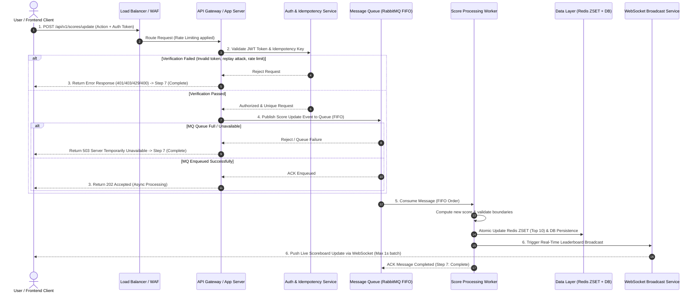

# Problem 6: Scoreboard API Module & Real-Time Leaderboard Specification

---

## 📌 Document Ownership & Source Attribution

| File / Document              | Owner & Origin                          | Description                                                                |
| :--------------------------- | :-------------------------------------- | :------------------------------------------------------------------------- |
| [`task.md`](task.md)         | **User** (Human / Prompt Author)        | Initial software requirements definition                                   |
| [`solution.md`](solution.md) | **User** (Human / Prompt Author)        | Architectural guidance, flow directions & improvement notes                |
| [`README.md`](README.md)     | **Gemini 3.7 Flash - High** (LLM Agent) | Comprehensive backend technical specification & architecture documentation |

---

## 1. Overview & Business Requirements

### 1.1 Purpose

This document defines the software module specification for the **Scoreboard API Module** on the backend application server. The module handles user score increase requests upon completing actions, enforces authorization and anti-cheat controls, maintains a **Top 10 Live Leaderboard**, and broadcasts real-time score updates to connected web clients.

### 1.2 Core System Rules & Domain Boundaries

1. **Top 10 Leaderboard Scope**: The system maintains and displays a live scoreboard showing the top 10 users ranked by highest total score.
2. **Display Isolation**: The score is **strictly used for display on the leaderboard** and does not alter or impact any other business logic, monetary balance, or application functionality.
3. **User Identifier**: Each user is uniquely identified by a `userId` (UUID v4 format).
4. **Score Boundaries**:
   - **Minimum Score (`minScore`)**: `0`
   - **Maximum Score (`maxScore`)**: `1,000,000,000` (1 Billion) to prevent integer overflow.
5. **Update Propagation Frequency**: Real-time broadcasts are throttled to update at **maximum once per second (≤ 1s latency window)**.

---

## 2. Architecture & Execution Flow

### 2.1 Execution Flow Sequence Diagram (Mermaid)



Mermaid View Link: [View Diagram](https://mermaid-viewer.com/en?code=JSUgT25saW5lIE1lcm1haWQgVmlld2VyCiUlIFRyeSBlZGl0aW5nIHRoaXMgZGlhZ3JhbS4KCnNlcXVlbmNlRGlhZ3JhbQogICAgYXV0b251bWJlcgogICAgYWN0b3IgQ2xpZW50IGFzIFVzZXIgLyBGcm9udGVuZCBDbGllbnQKICAgIHBhcnRpY2lwYW50IExCIGFzIExvYWQgQmFsYW5jZXIgLyBXQUYKICAgIHBhcnRpY2lwYW50IEFQSSBhcyBBUEkgR2F0ZXdheSAvIEFwcCBTZXJ2ZXIKICAgIHBhcnRpY2lwYW50IEF1dGggYXMgQXV0aCAmIElkZW1wb3RlbmN5IFNlcnZpY2UKICAgIHBhcnRpY2lwYW50IE1RIGFzIE1lc3NhZ2UgUXVldWUgKFJhYmJpdE1RIEZJRk8pCiAgICBwYXJ0aWNpcGFudCBXb3JrZXIgYXMgU2NvcmUgUHJvY2Vzc2luZyBXb3JrZXIKICAgIHBhcnRpY2lwYW50IERCIGFzIERhdGEgTGF5ZXIgKFJlZGlzIFpTRVQgKyBEQikKICAgIHBhcnRpY2lwYW50IFdTIGFzIFdlYlNvY2tldCBCcm9hZGNhc3QgU2VydmljZQoKICAgIENsaWVudC0%2BPkxCOiAxLiBQT1NUIC9hcGkvdjEvc2NvcmVzL3VwZGF0ZSAoQWN0aW9uICsgQXV0aCBUb2tlbikKICAgIExCLT4%2BQVBJOiBSb3V0ZSBSZXF1ZXN0IChSYXRlIExpbWl0aW5nIGFwcGxpZWQpCiAgICBBUEktPj5BdXRoOiAyLiBWYWxpZGF0ZSBKV1QgVG9rZW4gJiBJZGVtcG90ZW5jeSBLZXkKICAgIGFsdCBWZXJpZmljYXRpb24gRmFpbGVkIChJbnZhbGlkIHRva2VuLCByZXBsYXkgYXR0YWNrLCByYXRlIGxpbWl0KQogICAgICAgIEF1dGgtLT4%2BQVBJOiBSZWplY3QgUmVxdWVzdAogICAgICAgIEFQSS0tPj5DbGllbnQ6IDMuIFJldHVybiBFcnJvciBSZXNwb25zZSAoNDAxLzQwMy80MjkvNDAwKSAtPiBTdGVwIDcgKENvbXBsZXRlKQogICAgZWxzZSBWZXJpZmljYXRpb24gUGFzc2VkCiAgICAgICAgQXV0aC0tPj5BUEk6IEF1dGhvcml6ZWQgJiBVbmlxdWUgUmVxdWVzdAogICAgICAgIEFQSS0%2BPk1ROiA0LiBQdWJsaXNoIFNjb3JlIFVwZGF0ZSBFdmVudCB0byBRdWV1ZSAoRklGTykKICAgICAgICBhbHQgTVEgUXVldWUgRnVsbCAvIFVuYXZhaWxhYmxlCiAgICAgICAgICAgIE1RLS0%2BPkFQSTogUmVqZWN0IC8gUXVldWUgRmFpbHVyZQogICAgICAgICAgICBBUEktLT4%2BQ2xpZW50OiBSZXR1cm4gNTAzIFNlcnZlciBUZW1wb3JhcmlseSBVbmF2YWlsYWJsZSAtPiBTdGVwIDcgKENvbXBsZXRlKQogICAgICAgIGVsc2UgTVEgRW5xdWV1ZWQgU3VjY2Vzc2Z1bGx5CiAgICAgICAgICAgIE1RLS0%2BPkFQSTogQUNLIEVucXVldWVkCiAgICAgICAgICAgIEFQSS0tPj5DbGllbnQ6IDMuIFJldHVybiAyMDIgQWNjZXB0ZWQgKEFzeW5jIFByb2Nlc3NpbmcpCiAgICAgICAgZW5kCiAgICBlbmQKCiAgICBNUS0%2BPldvcmtlcjogNS4gQ29uc3VtZSBNZXNzYWdlIChGSUZPIE9yZGVyKQogICAgV29ya2VyLT4%2BV29ya2VyOiBDb21wdXRlIG5ldyBzY29yZSAmIHZhbGlkYXRlIGJvdW5kYXJpZXMKICAgIFdvcmtlci0%2BPkRCOiBBdG9taWMgVXBkYXRlIFJlZGlzIFpTRVQgKFRvcCAxMCkgJiBEQiBQZXJzaXN0ZW5jZQogICAgV29ya2VyLT4%2BV1M6IDYuIFRyaWdnZXIgUmVhbC1UaW1lIExlYWRlcmJvYXJkIEJyb2FkY2FzdAogICAgV1MtLT4%2BQ2xpZW50OiA2LiBQdXNoIExpdmUgU2NvcmVib2FyZCBVcGRhdGUgdmlhIFdlYlNvY2tldCAoTWF4IDFzIGJhdGNoKQogICAgV29ya2VyLS0%2BPk1ROiBBQ0sgTWVzc2FnZSBDb21wbGV0ZWQgKFN0ZXAgNzogQ29tcGxldGUp)

---

### 2.2 Detailed Step-by-Step Execution Breakdown

1. **User Action & Edge Request Handling**:
   - The user completes an action on the client application.
   - Client dispatches `POST /api/v1/scores/update`.
   - Request passes through **Load Balancer (Nginx/AWS ALB) + WAF** to filter DoS traffic and enforce per-IP rate limiting.
2. **Client Verification & Idempotency Check**:
   - API Gateway validates `Authorization: Bearer <JWT>` token.
   - Checks `X-Idempotency-Key` against Redis (TTL 60s) to prevent request spamming or duplicate execution.
   - Validates request payload signature (`X-Signature` HMAC hash with time-hashing) to prevent payload tampering.
3. **Early Asynchronous Response**:
   - If validation fails, API returns an appropriate JSON error response immediately (401/403/429/400) and terminates (Step 7).
   - If validation succeeds, request is passed to Step 4, and a `202 Accepted` response is returned asynchronously to the client.
4. **Queue Ingestion (RabbitMQ FIFO)**:
   - Validated requests are published to a durable RabbitMQ message queue with First-In-First-Out (FIFO) ordering for fairness.
   - **Queue Capacity & Rejection Handling**: If the queue is full or unavailable, request is rejected with a `503 Service Unavailable` response.
   - _Cloud Scaling Note_: In cloud infrastructure with dynamic auto-scaling queues, capacity expands on demand without throwing errors during traffic bursts.
5. **Worker Processing & Persistence**:
   - Background worker consumers pull messages sequentially from RabbitMQ.
   - Worker updates score in **Redis Sorted Set (`ZSET`)** for fast \(O(\log N)\) leaderboard ranking and persists changes to DB (PostgreSQL/MongoDB).
6. **Real-Time Broadcast**:
   - If a score update changes the Top 10 rankings, worker triggers a broadcast to the **WebSocket Server Cluster**.
   - Connected clients receive real-time JSON pushes containing updated Top 10 scoreboard details.
7. **Completion**:
   - Message is acknowledged (`ACK`) in RabbitMQ and execution lifecycle completes.

---

## 3. API & Protocol Specifications

### 3.1 HTTP Score Update API

- **Endpoint**: `POST /api/v1/scores/update`
- **Authentication**: `Bearer <JWT_TOKEN>`
- **Headers**:
  - `Content-Type: application/json`
  - `Authorization: Bearer <JWT_TOKEN>`
  - `X-Idempotency-Key: <UUID_V4>`
  - `X-Timestamp: <EPOCH_MILLISECONDS>`
  - `X-Signature: <HMAC_SHA256_HASH>`

#### Request Body

```json
{
  "userId": "usr_9f8a7b6c-5d4e-3f2a-1b0c-9d8e7f6a5b4c",
  "actionId": "act_score_increment_daily_challenge",
  "scoreDelta": 10
}
```

#### Success Response (`202 Accepted`)

```json
{
  "status": "success",
  "message": "Score update request accepted for processing.",
  "data": {
    "requestId": "req_8f7e6d5c4b3a",
    "timestamp": 1776659700000
  }
}
```

---

### 3.2 HTTP Get Top 10 Leaderboard API

- **Endpoint**: `GET /api/v1/scores/top`
- **Authentication**: None (Public)

#### Success Response (`200 OK`)

```json
{
  "status": "success",
  "data": {
    "leaderboard": [
      {
        "rank": 1,
        "userId": "usr_9f8a7b6c-5d4e-3f2a-1b0c-9d8e7f6a5b4c",
        "username": "Alice",
        "score": 9850,
        "updatedAt": "2026-08-20T11:30:00Z"
      },
      {
        "rank": 2,
        "userId": "usr_1a2b3c4d-5e6f-7a8b-9c0d-1e2f3a4b5c6d",
        "username": "Bob",
        "score": 9420,
        "updatedAt": "2026-08-20T11:32:15Z"
      }
    ],
    "lastRefreshed": "2026-08-20T11:34:29Z"
  }
}
```

---

### 3.3 WebSocket Real-Time Broadcast Protocol

- **Endpoint**: `WS /ws/v1/leaderboard`
- **Protocol**: WSS (WebSocket Secure)

#### Server Event: `LEADERBOARD_UPDATE`

```json
{
  "event": "LEADERBOARD_UPDATE",
  "timestamp": 1776659701000,
  "data": {
    "top10": [
      {
        "rank": 1,
        "userId": "usr_9f8a7b6c",
        "username": "Alice",
        "score": 9860
      },
      { "rank": 2, "userId": "usr_1a2b3c4d", "username": "Bob", "score": 9420 }
    ]
  }
}
```

---

## 4. Error Handling & Status Matrix

| Scenario                          | HTTP Status               | Error Code                       | Response Payload Message                                       |
| :-------------------------------- | :------------------------ | :------------------------------- | :------------------------------------------------------------- |
| Missing / Invalid Bearer Token    | `401 Unauthorized`        | `AUTH_TOKEN_INVALID`             | `"Authentication failed. Valid Bearer token is required."`     |
| Duplicate / Spammed Request       | `400 Bad Request`         | `DUPLICATE_REQUEST`              | `"Request rejected due to duplicate idempotency key."`         |
| Tampered Payload Signature        | `403 Forbidden`           | `INVALID_SIGNATURE`              | `"Forbidden. Request payload signature verification failed."`  |
| Rate Limit Exceeded               | `429 Too Many Requests`   | `RATE_LIMIT_EXCEEDED`            | `"Too many score update attempts. Please try again later."`    |
| RabbitMQ Queue Full / Unavailable | `503 Service Unavailable` | `SERVER_TEMPORARILY_UNAVAILABLE` | `"Server is temporarily unavailable. Please try again later."` |

#### Standard Error Response Format

```json
{
  "status": "error",
  "code": "AUTH_TOKEN_INVALID",
  "message": "Authentication failed. Valid Bearer token is required.",
  "timestamp": 1776659700000
}
```

---

## 5. Security & Anti-Cheat Mechanisms

1. **JWT Authentication & RBAC**: Requests require a signed JWT token issued upon client login.
2. **Request Idempotency & Replay Prevention**: Redis tracks `X-Idempotency-Key` for 60 seconds. Requests with duplicate keys within 60s are rejected immediately.
3. **HMAC SHA-256 Signature Verification**: Clients generate `X-Signature = HMAC_SHA256(payload + timestamp, client_secret)`. Request timestamps older than 30 seconds are rejected to prevent replay attacks.
4. **Token Bucket Rate Limiting**: Limits score updates to max 5 requests per second per user account and max 20 requests per second per IP address.

---

## 6. Architectural Improvements & Capacity Planning (Task #3)

### 6.1 Traffic Scale & System Capacity

- **Enterprise High Scale (Millions of Concurrent Users)**:
  - Uses **RabbitMQ FIFO queues**, **Redis Cluster (`ZSET`)**, worker consumer pools, and stateless API Gateways.
  - Decouples API response latency (\(< 15\text{ms}\)) from database write persistence.
- **Small-Scale Alternative (Single-Node / On-Premise)**:
  - For smaller applications (\(< 1,000\) active users), a single-node Express.js server with PostgreSQL and in-memory rate limiting can be used directly without a message queue.

### 6.2 Latency Tolerance & WebSocket Batching

- Real-time updates have an acceptable propagation latency window of **1–2 seconds**.
- Under peak write bursts (e.g., 50,000 updates/sec), pushing individual updates over WebSockets would flood frontend clients.
- **Throttling Strategy**: The WebSocket server applies a **1-second debounce buffer**, broadcasting consolidated leaderboard snapshots at maximum once per second.

### 6.3 Graceful Degradation & Cloud Autoscaling

- If queue depth reaches threshold limits, dynamic cloud auto-scaling (Kubernetes HPA / AWS ECS) launches additional worker containers.
- If primary DB encounters lock contention, Redis sorted set serves as an atomic in-memory fallback buffer.
